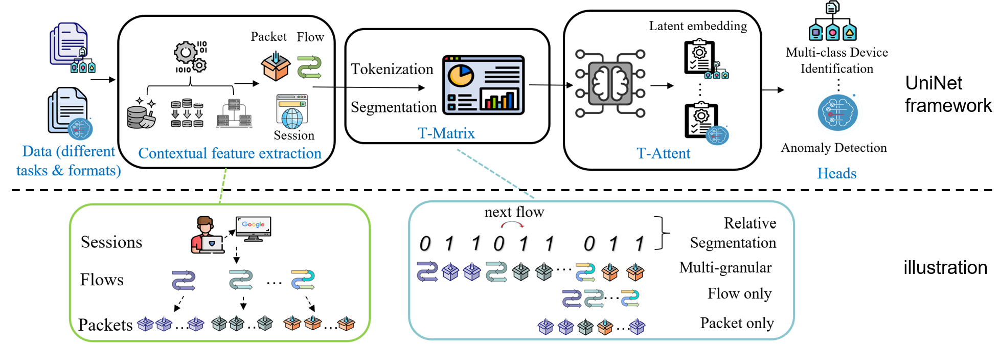

# UniNet : A Unified Multi-granular Traffic Modeling Framework for Network Security

The whole code coming soon


## Framework



`Input`: pcap of a traffic `Output`: Task specific output 

There are four tasks 


## Citation

If you find our work useful in your research, please consider citing our paper by:

```bibtex
@ARTICLE{11063437,
  author={Wu, Binghui and Divakaran, Dinil Mon and Gurusamy, Mohan},
  journal={IEEE Transactions on Cognitive Communications and Networking}, 
  title={UniNet: A Unified Multi-Granular Traffic Modeling Framework for Network Security}, 
  year={2025},
  volume={},
  number={},
  pages={1-1},
  doi={10.1109/TCCN.2025.3585170}}
```
