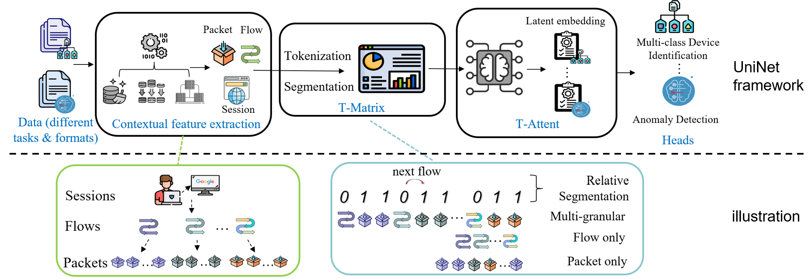

# UniNet

**A Unified Multi-Granular Traffic Modeling Framework for Network Security**

[](https://doi.org/10.1109/TCCN.2025.3585170)
[](https://github.com/Binghui99/UniNet/actions/workflows/test.yml)
[](pyproject.toml)
[](LICENSE)

UniNet combines a standardized multi-granular traffic representation (**T-Matrix**)
with a lightweight hierarchical attention model (**T-Attent**). The maintained
reproduction path is entirely Python: one standalone T-Matrix converter and four
task scripts. Historical notebooks are retained only under `legacy/`.

<p align="center">
  
</p>

## Install

T-Matrix preprocessing has no third-party dependency. PyTorch is optional and only
needed for model training.

```bash
python3 -m venv .venv
source .venv/bin/activate
python -m pip install -e .

# Add T-Attent and task training support.
python -m pip install -e '.[model]'
```

## One standalone T-Matrix tool

The root-level [tmatrix.py](tmatrix.py) accepts different traffic representations
and converts all of them to the same UniNet schema:

| Input | Auto-detection | Result |
|---|---|---|
| Classic PCAP | `.pcap` | Session + flow + packet features |
| Packet table | CSV, TSV, JSON, JSONL | Session + flow + packet features |
| Flow table | CSV, TSV, JSON, JSONL | Session + flow features; packet segment remains empty |
| Raw T-Matrix | `format=uninet-tmatrix-raw` | Validated and re-tokenized |

```bash
# PCAP -> tokenized model input.
python tmatrix.py capture.pcap \
  -o output/capture.json \
  --tokenizer-out output/tokenizer.json

# Packet CSV -> both auditable raw features and fixed-length tokens.
python tmatrix.py data/examples/packets.csv \
  -o output/packets.json \
  --representation both \
  --raw-output output/packets.raw.json

# NetFlow-style aggregate table. No fake packet records are created.
python tmatrix.py data/examples/flows.csv \
  -o output/flows.json \
  --input-kind flow

# Apply training quantiles to held-out data (prevents test leakage).
python tmatrix.py test.csv \
  -o output/test.json \
  --input-kind packet \
  --tokenizer-in output/train-tokenizer.json
```

After installation, `tmatrix` is equivalent to `python tmatrix.py`. Output samples
use the paper-defined fields `input`, `true_value`, `mask_index`, `segment_label`,
and `sequence_label`. The default is 2,000 tokens with `[MASK]=1040` and `[PAD]=1041`.

See [input formats](docs/input_formats.md) and the detailed
[T-Matrix design](docs/tmatrix.md).

## Four reproducible Python tasks

| Task | Python entry | UniNet head / evaluation |
|---|---|---|
| 1. Anomaly detection | `tasks/task1_anomaly_detection.py` | MFP pretraining + embedding autoencoder; ROC-AUC, TPR/FPR |
| 2. Attack identification | `tasks/task2_attack_identification.py` | MLP classifier; accuracy and macro metrics |
| 3. IoT device identification | `tasks/task3_iot_device_identification.py` | MLP classifier; accuracy and macro metrics |
| 4. Website fingerprinting | `tasks/task4_website_fingerprinting.py` | Closed-world classification plus optional open-world TPR/FPR |

Every script supports `--config`, direct CLI overrides, deterministic stratified
splits, CPU/CUDA/MPS selection, checkpoint saving, and `--dry-run` validation.

```bash
# Validate all four included synthetic datasets without PyTorch training.
python tasks/task1_anomaly_detection.py \
  --config configs/tasks/task1_anomaly.json --dry-run
python tasks/task2_attack_identification.py \
  --config configs/tasks/task2_attack.json --dry-run
python tasks/task3_iot_device_identification.py \
  --config configs/tasks/task3_iot.json --dry-run
python tasks/task4_website_fingerprinting.py \
  --config configs/tasks/task4_website.json --dry-run

# Actual training (remove --dry-run).
python tasks/task3_iot_device_identification.py \
  --dataset output/iot-train.json \
  --output-dir output/task3 \
  --epochs 30

# Open-world website evaluation with an explicit unknown class.
python tasks/task4_website_fingerprinting.py \
  --dataset output/websites.json \
  --unknown-label unknown \
  --output-dir output/task4
```

Training writes `model.pt` and `metrics.json`. Task details and data-leakage
considerations are documented in [task recipes](docs/tasks.md).

## Smoke data

```bash
# PCAP -> T-Matrix smoke fixtures.
uninet smoke --output-dir data/smoke

# Four tiny tokenized task datasets.
python scripts/generate_task_smoke_data.py

# Full dependency-free validation.
python -m unittest discover -s tests -v
```

The smoke datasets are synthetic software fixtures, not scientific benchmarks.
They must not be used to claim detection or classification performance.

## Repository structure

```text
tmatrix.py                         standalone multi-input standardizer
tasks/
  task1_anomaly_detection.py      unsupervised anomaly pipeline
  task2_attack_identification.py  attack classifier
  task3_iot_device_identification.py
  task4_website_fingerprinting.py
src/uninet/                        maintained implementation
configs/tasks/                     four runnable task configs
data/examples/                     packet and flow input examples
data/smoke/                        deterministic smoke fixtures
tests/                             converter, schema, task and model tests
docs/                              formats and reproducibility guidance
legacy/                            original notebooks/scripts (not primary entry points)
```

## Capture support and safety

The built-in decoder supports classic PCAP with Ethernet/VLAN, Linux SLL v1, or
raw IPv4/IPv6. Convert PCAPNG first:

```bash
editcap -F pcap input.pcapng output.pcap
```

PCAPs may contain sensitive communications and identifiers. Obtain authorization,
minimize collection, anonymize before sharing, and never commit private captures.
See [SECURITY.md](SECURITY.md).

## Paper and citation

B. Wu, D. M. Divakaran, and M. Gurusamy, "UniNet: A Unified Multi-Granular
Traffic Modeling Framework for Network Security," *IEEE Transactions on Cognitive
Communications and Networking*, vol. 12, pp. 2424-2438, 2026,
doi: [10.1109/TCCN.2025.3585170](https://doi.org/10.1109/TCCN.2025.3585170).

```bibtex
@article{wu2026uninet,
  author  = {Wu, Binghui and Divakaran, Dinil Mon and Gurusamy, Mohan},
  title   = {UniNet: A Unified Multi-Granular Traffic Modeling Framework for Network Security},
  journal = {IEEE Transactions on Cognitive Communications and Networking},
  volume  = {12},
  pages   = {2424--2438},
  year    = {2026},
  doi     = {10.1109/TCCN.2025.3585170}
}
```

Code is released under the [MIT License](LICENSE). External datasets retain their
own licenses and redistribution terms.
